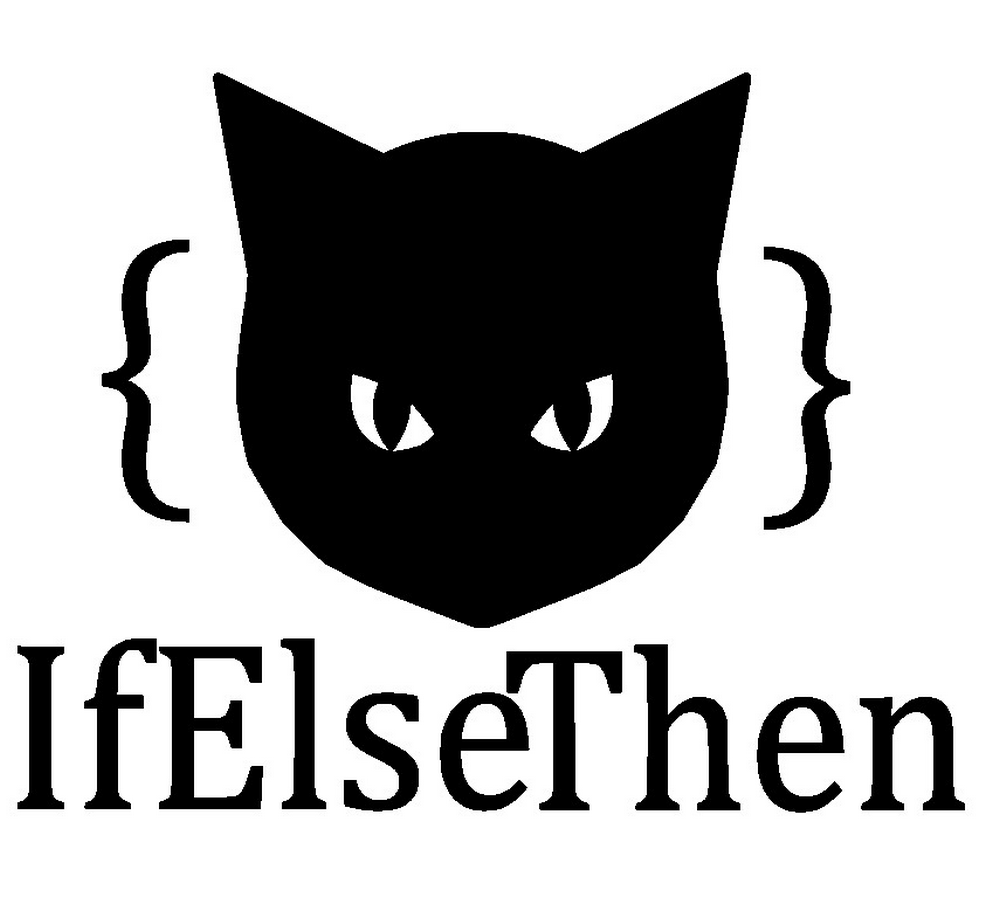

<div align="center">



```
   ___  ___       __   ___ ___       ___
| |__  |__  |    /__` |__   |  |__| |__  |\ |
| |    |___ |___ .__/ |___  |  |  | |___ | \|
```

*Est. 2011 · Science, Technology, Research and Development*

[](https://ifelsethen.com)
[](mailto:contact@ifelsethen.com)

</div>

---

## What We Build

IfElseThen builds software across the full stack — web, mobile, desktop, server, CLI, and games. Products are built to solve real problems.

Wide scope by design: SaaS, B2B, B2C, browser extensions, APIs, multiplayer backends, and games — whatever the problem calls for.

---

<div align="center">

*IfElseThen™ · Est. 2011*

</div>